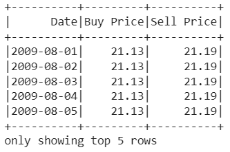
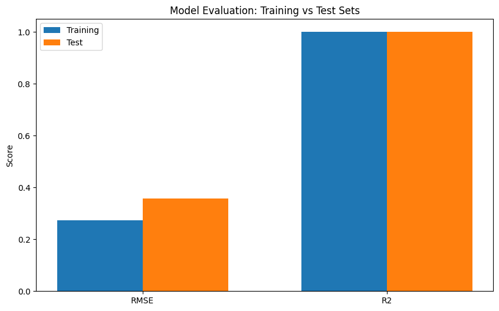

## Overview

Predicting financial markets is notoriously difficult, but the challenge scales exponentially when dealing with massive historical datasets. This project aims to forecast daily gold prices using a distributed Machine Learning pipeline built entirely on Apache Spark (PySpark).

Instead of relying on single-node libraries like `scikit-learn` or `pandas`, I engineered this solution to run natively in a distributed cluster environment, showcasing my ability to handle Big Data constraints and scale computations horizontally.

## The Challenge: Time-Series in a Distributed Paradigm

Time-series forecasting typically requires sequential data access, which fundamentally clashes with the distributed, partitioned nature of Spark DataFrames. To predict the gold price on day $t$, the model needs the prices from the 10 preceding days ($t-10$ to $t-1$).

If this were a simple Pandas dataframe, a basic `.shift()` operation would suffice. However, in Spark, data is scattered across multiple nodes, making sequential operations complex.

## The Solution: PySpark Windowing & MLlib Pipeline

To solve this efficiently without shuffling massive amounts of data across the network, I built a robust pipeline:

* **Distributed Lag Features:** I partitioned the data chronologically and applied `lag()` operations over a PySpark sliding `Window`. This successfully flattened the temporal dependencies into 10 distinct feature columns per row in a distributed manner.
* **Vector Assembly:** I used `VectorAssembler` to merge these 10 lag features into a single `DenseVector` per row, conforming to Spark MLlib's required input format.
* **Standardization:** To ensure the gradient descent algorithm converged smoothly, I fitted a `StandardScaler` to center the features (mean=0, std=1) before passing them to the estimator.

## Results & Impact

The resulting `LinearRegression` model was trained on historical data spanning from August 2009 to January 2025. It achieved an outstanding $R^2$ score of 0.9995 on the unseen test set, with a minimal RMSE of 0.3567.

This project not only yielded a highly accurate forecasting model but also solidified my expertise in constructing end-to-end, scalable machine learning workflows using PySpark MLlib.